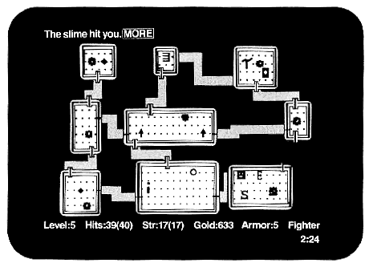

# Project Team 01 — Python_Bootcamp

В этом проекте необходимо разработать консольное игровое roguelike-приложение на языке программирования Python с использованием библиотеки curses в духе классической игры Rogue 1980 года разработки.

## Содержание
 1. [Chapter I](#chapter-i)   
 2. [Chapter II](#chapter-ii)  
     - [Общая информация](#общая-информация) 
         - [Rogue 1980](#rogue-1980)  
         - [Архитектура приложения](#архитектура-приложения)   
 3. [Chapter III](#chapter-iii)      
     - [Задание 0. Как мы здесь очутились?](#задание-0-как-мы-здесь-очутились)  
     - [Задание 1. Сущностные сущности игровой игры](#задание-1-сущностные-сущности-игровой-игры)  
     - [Задание 2. Бодрый геймплей](#задание-2-бодрый-геймплей)  
     - [Задание 3. Сгенерированный мир](#задание-3-сгенерированный-мир)  
     - [Задание 4. Ламповое 2D](#задание-4-ламповое-2d)  
     - [Задание 5. Картридж с батарейкой](#задание-5-картридж-с-батарейкой)  
     - [Задание 6. Дополнительно. Ты не пройдешь!](#задание-6-дополнительно-ты-не-пройдешь)  
     - [Задание 7. Дополнительно. Искусство баланса](#задание-7-дополнительно-искусство-баланса)  
     - [Задание 8. Дополнительно. Представь, что ты стол](#задание-8-дополнительно-представь-что-ты-стол)  
     - [Задание 9. Дополнительно. Полное ТРИ-ДЭ](#задание-9-дополнительно-полное-три-дэ)  

         

## Chapter I

## Chapter II
## Общая информация

### Rogue 1980

Rogue (разбойник, плут) — компьютерная игра, разработанная в 1980 году компанией Epyx. Ее основной темой является исследование подземелий. Игра была необычайно популярной на университетских Unix-системах в начале 1980-х годов и породила целый жанр, известный как Roguelike (Rogue-подобные игры, т. н. «Рогалики»).

В Rogue игрок выполняет типичную для ранних фэнтезийных ролевых игр роль искателя приключений. Игра начинается на самом верхнем ярусе не нанесенного на карту подземелья с большим количеством монстров и сокровищ. Постепенно по мере продвижения вглубь случайно сгенерированного подземелья, возрастает сила монстров и продвижение усложняется.

Всякий ярус подземелья состоит из сетки 3х3 комнаты или тупикового коридора, в конце которого можно было бы ожидать комнату. Более поздние варианты также включают вместе с комнатами «лабиринты», извилистые коридоры с тупиками. В отличие от большинства приключенческих игр того времени, расположение подземелья и расположение объектов в нем генерировалось случайным образом. Таким образом, каждое прохождение игры становилось уникальным и в равной степени рискованным как для новичков, так и для опытных игроков.

У игрока есть 3 характеристики: здоровье, физическая сила и опыт. Все 3 характеристики можно как и увеличить с помощью различных зелий и свитков, так и уменьшить, наступив на ловушку или прочитав проклятый свиток. Большой выбор магических зелий, свитков, волшебных жезлов, оружия, брони и еды приводит к высокому разнообразию игры и различным способам выиграть или проиграть. 

### Архитектура приложения
При реализации прикладных проектов с данными, бизнес-логикой и пользовательским интерфейсом, как правило, используется многослойная архитектура. Классическое стандартное разделение может быть представлено так:
- Слой представления (Presentation, View, UI);
- Слой бизнес-логики (Domain, Business Logic);
- Слой доступа к данным (Data Source, Data Access).

Разделение логики на бизнес и презентационные слои поможет легче организовать логику в приложении и разделить компоненты с разной устойчивостью. 

Так, в слое **presentation** необходимо разместить код, который будет организовывать логику отображения на экране пользователя и ввод пользовательских данных. То есть здесь должно быть отражено взаимодействие с компонентами библиотеки curses и Domain-уровнем. 

Слой **domain** должен отражать бизнес-логику приложения, не связанную с фреймворками. В текущем проекте это определение логики сущностей, связанных с игрой — сама игра, игрок, противник, уровни, карта и другие, а также логика игрового процесса. Так, местоположение игрока и логика изменения положения игрока в числовых характеристиках на карте должны быть отражены в этом слое и затем переданы для отображения в *presentation*-слой. Обрати внимание, что в соответствии с концепцией чистой архитектуры, слой бизнес-логики не должен зависеть от остальных слоев. Для того чтобы этого добиться, необходимо использовать принцип инверсии зависимостей.

Для удобной организации взаимодействия между слоями также можно воспользоваться практикой семейства паттернов **MVC** (**MVP**, **MVVM**, **MVPVM** и др.), где слои логики приложения (**Model**) связываются со слоями представления (**View**) при помощи специальных «связочных» служебных слоев (**Controller**, **Presenter**, **View Model** и др.). В разных языках программирования и фреймворках устоялись свои предпочтительные способы формализации и связывания таких слоев, но принцип часто очень схожий.

Слой **datalayer** в приложении должен будет отвечать за работу с данными. В данном случае — за хранение истории прошлых игр, а также хранение данных о текущей игровой сессии.

## Chapter III

## Задание 0. Как мы здесь очутились?

Игровое приложение:
 - должно быть реализовано на языке Python версии 3.10;
 - должно иметь консольный интерфейс на базе библиотеки curses;
 - должно управляться с клавиатуры;
 - должно иметь продуманную, чистую архитектуру с четким разделением на слои;
 - должно реализовать логику классической игры Rogue 1980 года с рядом упрощений (конкретные требования к игровым механикам описаны в следующих разделах);
 - если какие-то детали организации игрового процесса не покрыты настоящим текстом, то допустимо опираться на логику оригинальной механики 1980 года.

## Задание 1. Сущностные сущности игровой игры
Игра должна поддерживать разделение слоев, описанное в разделе «Архитектура приложения». В игре должны быть выделены слои: домена и геймплея, рендеринга и работы с данными.

Для начала разработки игры реализуй доменный слой, в котором будут описаны основные игровые сущности. Основные рекомендуемые сущности с базовыми атрибутами (необходимый, но недостаточный перечень):
- Игровая сессия;
- Уровень;
- Комната;
- Коридор;
- Персонаж:
  + максимальный уровень здоровья,
  + здоровье,
  + ловкость,
  + сила,
  + текущее оружие;
- Рюкзак;
- Противник:
  + тип,
  + здоровье,
  + ловкость,
  + сила,
  + враждебность;
- Предмет:
  + тип,
  + подтип,
  + здоровье (количество единиц повышения, для еды),
  + максимальный уровень здоровья (количество единиц повышения, для свитков и эликсиров, вместе с этим повышается и сам уровень здоровья),
  + ловкость (количество единиц повышения, для свитков и эликсиров),
  + сила (количество единиц повышения, для свитков, эликсиров и оружия),
  + стоимость (для сокровищ).

## Задание 2. Бодрый геймплей
Реализуй геймплей игры в уровне **domain** независимо от **presentation** и **datalayer**.

### Логика игры
- Игра должна содержать 21 уровень с подземельями.
- Каждый уровень подземелья должен состоять из 9 комнат, соединенных коридорами, из любой комнаты по этим коридорам можно попасть в любую другую.
- В каждой комнате могут находиться противники и предметы, за исключением стартовой комнаты.
- Игрок управляет перемещением персонажа, может взаимодействовать с предметами и сражаться с противниками.
- Цель игрока — найти на каждом уровне переход на следующий уровень и, таким образом, пройти 21 уровень.
- На каждом уровне игрок начинает в случайной позиции стартовой комнаты, где гарантированно отсутствуют противники.
- После смерти главного героя состояние игры сбрасывается и все возвращается к началу.
- С каждым новым уровнем повышается количество и сложность противников, снижается количество полезных предметов и повышается количество сокровищ, которые выпадают с побежденных противников.
- После любого прохождения (успешного и нет) результат игрока фиксируется в таблицу рекордов, где указывается достигнутый уровень подземелья и количество собранных сокровищ. Таблица рекордов должна сортироваться по количеству сокровищ.
- Вся игра должна работать в пошаговом режиме (каждое действие игрока запускает действия противников), пока игрок не сделал ход, весь мир стоит в ожидании.

### Логика персонажа
- Характеристика здоровья персонажа должна показывать его текущий уровень здоровья, и когда здоровье персонажа достигает 0 или становится меньше 0, игра должна закончиться.
- Характеристика максимального уровня здоровья должна показывать максимальный уровень здоровья персонажа, который может быть восстановлен путем употребления еды.
- Характеристика ловкости должна участвовать в формуле вычисления вероятности попадания противников по персонажу и персонажа по противникам.
- Характеристика силы должна определять базовый урон, наносимый персонажем без оружия, а также должна участвовать в формуле вычисления урона при использовании оружия.
- За победу над противником персонаж получает количество сокровищ, зависящее от сложности противника.
- Персонаж может поднимать предметы и складывать в свой рюкзак, а затем использовать их.
- Каждый предмет при использовании может временно или постоянно изменять одну из характеристик персонажа.
- Достигнув выхода из уровня, персонаж автоматически попадает на следующий уровень.

### Логика противников
- Каждый противник имеет аналогичные игроку характеристики здоровья, ловкости и силы, дополнительно к этому имеет характеристику враждебности.
- Характеристика враждебности определяет расстояние, с которого противник начинает преследовать игрока.
- 5 видов противников: 
  + Зомби (отображение: зеленый z): низкая ловкость; средняя сила, враждебность; высокое здоровье. 
  + Вампир (отображение: красная v): высокая ловкость, враждебность и здоровье; средняя сила. Отнимает некоторое количество максимального уровня здоровья игроку при успешной атаке. Первый удар по вампиру — всегда промах. 
  + Привидение (отображение: белый g): высокая ловкость; низкая сила, враждебность и здоровье. Постоянно телепортируется по комнате и периодически становится невидимым, пока игрок не вступил в бой. 
  + Огр (отображение: желтый O): ходит по комнате на две клетки. Очень высокая сила и здоровье, но после каждой атаки отдыхает один ход, затем гарантированно контратакует; низкая ловкость; средняя враждебность.
  + Змей-маг (отображение: белая s): очень высокая ловкость. Ходит по карте по диагонали, постоянно меняя сторону. У каждой успешной атаки есть вероятность «усыпить» игрока на один ход. Высокая враждебность.
- Каждый тип противников имеет свой паттерн для передвижения по комнате.
- Когда начинается преследование игрока, все монстры двигаются по одному паттерну, кратчайшим путем по соседним клеткам в сторону игрока.
- Если игрок находится в области, когда монстр должен начать его преследовать, но при этом не существует пути к нему, то монстр продолжает двигаться случайным образом по своему паттерну.

### Логика окружения
- Каждый тип предмета имеет свое значение:
  + сокровища (имеют стоимость, накапливаются и влияют на итоговый рейтинг, можно получить только при победе над монстром);
  + еда (восстанавливает здоровье на некоторую величину);
  + эликсиры (временно повышают одну из характеристик: ловкость, силу, максимальное здоровье);
  + свитки (постоянно повышают одну из характеристик: ловкость, силу, максимальное здоровье);
  + оружие (имеют характеристику силы, при использовании оружия меняется формула вычисления наносимого урона).
- При повышении максимального уровня здоровья сама величина здоровья увеличивается на ту же величину.
- Если после окончания действия эликсира здоровье становится равным 0 или ниже 0, необходимо установить игроку минимально возможную величину здоровья для продолжения игры.
- Рюкзак хранит в себе все типы предметов.
- Когда персонаж наступает на предмет, он автоматически должен добавляться в рюкзак, если он неполон (в рюкзаке может храниться максимум 9 предметов каждого типа, сокровища копятся и хранятся в единственной ячейке).
- Еда, эликсиры, свитки при использовании тратятся.
- Оружие при смене должно падать на пол на соседнюю клетку.
- Каждый уровень подземелья имеет наполнение, зависящее от своего индекса: 
  + Чем глубже уровень, тем он сложнее.
  + Уровень состоит из комнат.
  + Комнаты соединены коридорами.
  + Комнаты содержат противников и предметы.
  + Противники и персонаж могут перемещаться по комнатам и коридорам.
  + Каждый уровень имеет гарантированный переход на следующий уровень.
  + Выход из последнего уровня завершает игру.

### Логика боя
- Бой вычисляется в пошаговом режиме.
- Атака производится путем перемещения персонажа по направлению к противнику.
- Инициация боя происходит при контакте с врагом.
- Удары просчитываются по очереди, в несколько этапов: 
  + 1 этап расчета удара — проверка на попадание. Проверка на попадание случайна и высчитывается из ловкости бьющего и цели удара.
  + 2 этап — расчет урона. Рассчитывается из силы и модификаторов (оружия).
  + 3 этап — применение урона. Урон вычитается из здоровья. Если здоровье падает до 0 или ниже, то противник или персонаж погибает.
- Из каждого противника при победе выпадает случайное количество сокровищ, зависящее от враждебности, силы, ловкости и здоровья противника.

## Задание 3. Сгенерированный мир
Реализуй модуль генерации уровней в уровне **domain**.

- Каждый уровень должен быть логически разделен на 9 секций, в каждой из которых случайным образом генерируется комната с произвольным размером и положением.
- Комнаты произвольным образом соединены коридорами. Коридоры имеют свою геометрию, по ним тоже можно ходить, а значит, их координаты необходимо генерировать и хранить. При генерации необходимо проверять, что сгенерированный граф комнат — связный и не имеет ошибок.
- На каждом уровне одна комната помечена как стартовая, и еще одна — как конечная. В стартовой комнате начинается игровая сессия, а в конечной располагается блок, при прикосновении к которому игрок перемещается на следующий уровень.
- Пример реализации генерации уровней представлен в папке code-samples.

## Задание 4. Ламповое 2D
Реализуй с curses рендеринг игры в **presentation**-слое, используя необходимые сущности **domain**.

### Отображение 
- Рендеринг среды — стены, пол, проем в стене, коридоры между комнатами.
- Рендеринг акторов — персонаж, противники, подбираемые предметы.
- Рендеринг интерфейса — отображение игрового интерфейса (панель статуса, инвентаря, простое меню).
- Туман войны — зависимость рендеринга сцены от состояния игры:
  + Неизведанные комнаты и коридоры не отображаются.
  + Просмотренные комнаты, но в которых не находится игрок, отображаются только как стены.
  + В комнате, в которой находится игрок, отображаются стены, пол, акторы и предметы.
  + При нахождении в непосредственной близости с комнатой со стороны коридора туман войны рассеивается только на области прямой видимости (применяется алгоритм Ray Casting и алгоритм Брезенхэма для определения видимой области).
- Пример реализации рендеринга уровней представлен в папке code-samples.

### Управление
- Управление персонажем:
  + Передвижение при помощи клавиш WASD.
  + Применение оружия из рюкзака при помощи кнопки h.
  + Применение еды из рюкзака при помощи кнопки j.
  + Применение эликсира из рюкзака при помощи кнопки k.
  + Применение свитка из рюкзака при помощи e.
- Любое использование чего-либо из рюкзака должно приводить к печати списка предметов этого типа на экран с вопросом игроку, что нужно выбрать (1–9).
- При выборе оружия также должна иметься возможность убрать оружие из рук, не выбрасывая из инвентаря (соответственно, для оружия выбор будет 0–9).

### Статистика
- В игре собирается и отображается в отдельном представлении статистика всех прохождений, отсортированная по количеству набранных сокровищ: количество сокровищ, достигнутый уровень, количество побежденных противников, количество съеденной еды, количество выпитых эликсиров, количество прочитанных свитков, количество нанесенных и пропущенных ударов, количество пройденных клеток.

## Задание 5. Картридж с батарейкой
Реализуй слой **datalayer**, в котором будет производиться сохранение и извлечение данных об игровом прогрессе игрока в файле ``json``.
- После прохождения каждого уровня необходимо сохранять полученную статистику и номер пройденного уровня.
- После перезапуска игры, если игрок хочет продолжить последнюю сохраненную сессию, уровни должны генерироваться в соответствии с сохраненной информацией, а прогресс игрока — полностью восстанавливаться (набранные очки, текущие значения характеристик), т. е. должна быть восстановлена вся информация об игровой сессии вплоть до расположения отдельных сущностей и их характеристик.
- Также должна сохраняться статистика по всем попыткам прохождений, и при просмотре игроком таблицы лидеров должны отображаться лучшие попытки прохождения (необязательно успешные).

## Задание 6. Дополнительно. Ты не пройдешь!
- Сгенерируй двери между комнатами и коридорами и ключи к ним. Необходимо реализовать систему разноцветных ключей наподобие классической DOOM. 
- При решении задачи необходимо использовать модифицированные алгоритмы поиска в глубину/ширину для проверки доступности ключей и валидности генерации на отсутствие софтлоков.

## Задание 7. Дополнительно. Искусство баланса
- Добавь систему автоматической подстройки под уровень игрока. Если игрок легко проходит уровни, необходимо увеличивать сложность. Если игрок сталкивается с трудностями, можно добавлять немного больше полезных для игрока предметов (например, если игрок часто тратит здоровье — предоставлять больше аптечек) и понизить количество и сложность врагов.

## Задание 8. Дополнительно. Представь, что ты стол
- Добавь в игру противника Мимик (белая m), который имитирует предметы. Высокая ловкость, низкая сила, высокое здоровье и низкая враждебность. 

## Задание 9. Дополнительно. Полное ТРИ-ДЭ
- Добавь режим 3D-рендеринга, в котором:
  + Основной вид переключается на 3D-вид от первого лица.
  + 2D-вид остается в режиме мини-карты в углу экрана.
  + Управление меняется соответствующим образом: W — перед, S — назад, A — поворот налево, D — поворот направо.
- Для 3D-рендеринга комнат и коридоров используй алгоритм Ray Casting и библиотеку curses.
- Стены комнат и туннелей должны иметь текстуру, чтобы перемещение персонажа было заметным.
- Пример реализации 3D-рендеринга уровней представлен в папке code-samples.
